# 📚 CourseCraft AI — Agentic AI-Powered Curriculum & Assessment Generator

<div align="center">

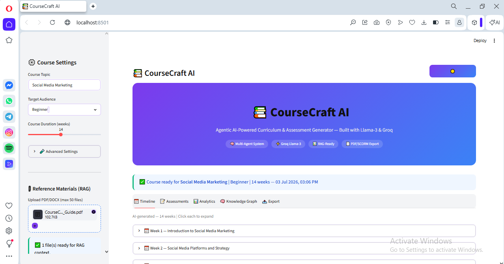

[](https://coursecraft-ai-pc5kmmcpmgwxsmrhkkcpqn.streamlit.app/)
[](https://github.com/Aghawafaabbass/coursecraft-ai)
[](https://python.org)
[](https://streamlit.io)
[](https://groq.com)
[](LICENSE)

**A production-grade, multi-agent AI system that generates complete course curricula, assessments, and knowledge graphs in seconds — powered by Groq's ultra-fast Llama-3 inference engine.**

</div>

---

## 🔗 Live Application

> **🌐 [https://coursecraft-ai-pc5kmmcpmgwxsmrhkkcpqn.streamlit.app/](https://coursecraft-ai-pc5kmmcpmgwxsmrhkkcpqn.streamlit.app/)**

---

## 📋 Table of Contents

1. [What is CourseCraft AI?](#-what-is-coursecraft-ai)
2. [Why CourseCraft AI?](#-why-coursecraft-ai--not-just-another-chatbot)
3. [Key Features](#-key-features)
4. [Who Should Use This?](#-who-should-use-this)
5. [System Architecture](#-system-architecture)
6. [Data Flow Diagram](#-data-flow-diagram)
7. [Multi-Agent Pipeline](#-multi-agent-pipeline)
8. [Class Diagram](#-class-diagram)
9. [Entity Relationship Diagram](#-entity-relationship-diagram-erd)
10. [Tech Stack](#-tech-stack)
11. [Skills Demonstrated](#-skills-demonstrated)
12. [Screenshots](#-screenshots)
13. [Local Setup](#-local-setup)
14. [Deployment](#-deployment)
15. [Project Structure](#-project-structure)
16. [Future Roadmap](#-future-roadmap)
17. [Author](#-author)
18. [License](#-license)

---

## 🎯 What is CourseCraft AI?

**CourseCraft AI** is an **Agentic AI** application that replaces hours of manual work required to design a course curriculum. A teacher, trainer, or content creator simply enters:

- 📌 **Course Topic** (e.g., "Social Media Marketing")
- 👥 **Target Audience** (Beginner / Intermediate / Advanced)
- 📅 **Duration** (1–30 weeks)

And within seconds, three specialized AI agents working in pipeline produce:

| Output | Description |
|--------|-------------|
| 📅 **Weekly Curriculum** | Module title, objectives, topics, and exercises per week |
| 📝 **Assessments** | MCQ quizzes (A/B/C/D), weekly assignments, grading rubric |
| 🧠 **Knowledge Graph** | Core concepts and their relationships visualized |
| 📊 **Token Analytics** | Real-time cost and token usage dashboard |
| 📄 **Multi-Format Export** | PDF, Markdown, JSON, LinkedIn snippet |

---

## 🏆 Why CourseCraft AI? — Not Just Another Chatbot

Most people think: *"Why build this when ChatGPT already exists?"*

Here is the honest, technical answer.

### The Core Problem With Chatbots for Education Design

When you ask ChatGPT to "create a 12-week Python course," you get a wall of unstructured text in a single response. You still have to:
- Manually copy-paste into a document
- Format it yourself
- Re-prompt if anything is wrong
- Do everything again when you need assessments
- Start over for a different topic

**CourseCraft AI solves this with a fundamentally different architecture.**

### What Makes This Different

#### 1. Multi-Agent System, Not a Single Prompt
CourseCraft AI runs **three specialized agents in sequence**, each with a distinct job:
- Agent 1 designs the curriculum
- Agent 2 reads that curriculum and generates assessments specifically for it
- Agent 3 reads the same curriculum and extracts a knowledge graph

No single chatbot prompt can reliably do all three with structured, parseable output.

#### 2. Structured Output, Not Free Text
Every agent is engineered to return **valid JSON** with a defined schema. The application then parses this into interactive UI components — expandable week cards, A/B/C/D quiz options, grading rubric rows — not raw text you have to read through.

#### 3. Session Persistence
ChatGPT forgets everything when you close the tab. CourseCraft AI uses `st.session_state` to cache all generated content — your 12-week course stays in the UI until you decide to regenerate.

#### 4. Owned Infrastructure
ChatGPT is a product you pay for and have no control over. CourseCraft AI is your own deployed application — on your GitHub, on your Streamlit URL, with your own API keys. You control the model, the cost, and the data.

#### 5. Real-Time Cost Transparency
Every generation shows exact input tokens, output tokens, and estimated USD cost. ChatGPT and similar products hide this entirely.

### Side-by-Side Comparison

| Capability | ChatGPT / Gemini / Copilot | CourseCraft AI |
|---|---|---|
| **Output type** | Unstructured text | Parsed JSON → interactive UI |
| **Agent architecture** | Single prompt → single response | 3 specialized agents in pipeline |
| **Self-correction** | None | Agent 2 builds on Agent 1's output |
| **Session memory** | Lost on refresh | Persisted via `st.session_state` |
| **Export** | Copy-paste only | PDF, Markdown, JSON download |
| **Cost visibility** | Hidden | Real-time token + USD dashboard |
| **File upload context** | Limited / paid tier | 50-file PDF/DOCX RAG-ready |
| **Inference speed** | 3–15 seconds | Sub-second via Groq |
| **Customization** | Prompt only | Model, duration, audience, mode |
| **Ownership** | SaaS product | Your own production application |
| **Deployment** | Closed platform | GitHub + Streamlit Cloud |

### Why Not Just Use the Groq API Directly?

You could — but then you would have no UI, no structured parsing, no export, no session state, no multi-agent orchestration, and no way to share it with a colleague or student. CourseCraft AI is the production layer on top of raw API access.

### Future Importance

Agentic AI — systems where multiple AI models collaborate with defined roles — is the direction the entire industry is moving. Tools like LangChain, AutoGen, and CrewAI are all trying to solve this. CourseCraft AI demonstrates the same architecture pattern in a focused, domain-specific application that a non-technical educator can actually use.

---

## ✨ Key Features

### 🧠 Agentic AI Core
- **Agent 1 — Curriculum Designer:** Uses `llama-3.1-8b-instant` or `llama-3.3-70b-versatile` to generate structured week-by-week course outline in valid JSON
- **Agent 2 — Assessment Engine:** Generates MCQ quizzes, weekly assignments, and weighted grading rubric per curriculum
- **Agent 3 — Knowledge Graph Extractor:** Extracts core concepts and their prerequisite/leads-to relationships

### ⚡ Groq-Powered Speed
- Ultra-fast inference via Groq Cloud API — full 12-week course generated in approximately 10 seconds
- Model selection: Fast Draft (8B), High Quality (70B), or Auto-Switch

### 📊 Token Analytics Dashboard
- Real-time input/output token counts across all agents
- Estimated cost per generation based on Groq public pricing

### 🧠 Knowledge Graph Visualization
- AI extracts 8–12 key concepts from course content
- Displays concept nodes and directed relationship edges

### 📤 Multi-Format Export
- **PDF** — Structured, printable course package (curriculum + assessments + knowledge graph)
- **Markdown** — GitHub/Notion-ready formatted document
- **JSON** — LMS-importable structured data
- **LinkedIn Snippet** — One-click professional post generator

### 🌙 Light/Dark Theme
- Full dark/light mode toggle with proper contrast across all components

### 📎 Reference Materials (RAG-Ready)
- Upload up to 50 PDF/DOCX files as context for grounded generation

---

## 👥 Who Should Use This?

| User Type | Use Case |
|---|---|
| 🎓 **University Lecturers** | Design new module outlines in minutes instead of days |
| 🏢 **Corporate Trainers** | Create employee onboarding and upskilling programs rapidly |
| 💼 **Bootcamp Instructors** | Structure short-term skill courses (e.g., "Python in 6 weeks") |
| 🌐 **Online Course Creators** | Draft Udemy/Coursera course structure before production |
| 📚 **Self-Learners** | Generate a personalized structured learning path |
| 🤖 **AI Engineers** | Reference implementation of multi-agent Streamlit architecture |

---

## 🏗️ System Architecture

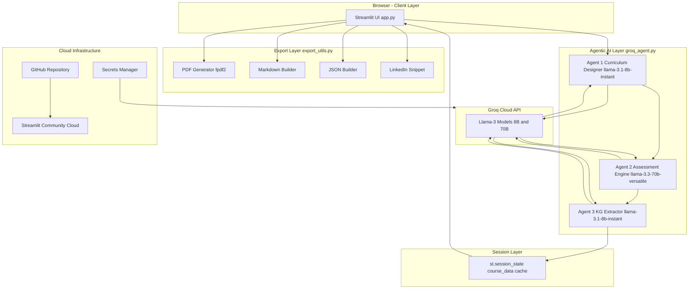

---

## 🔄 Data Flow Diagram

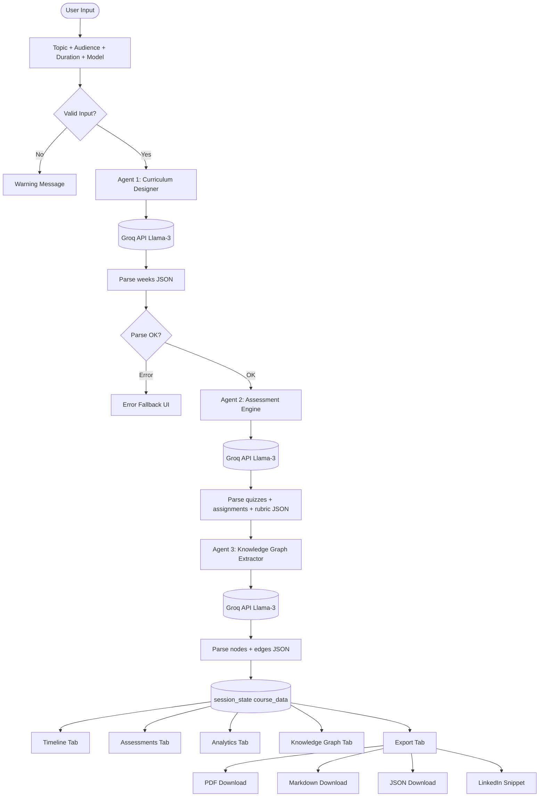

---

## 🤖 Multi-Agent Pipeline

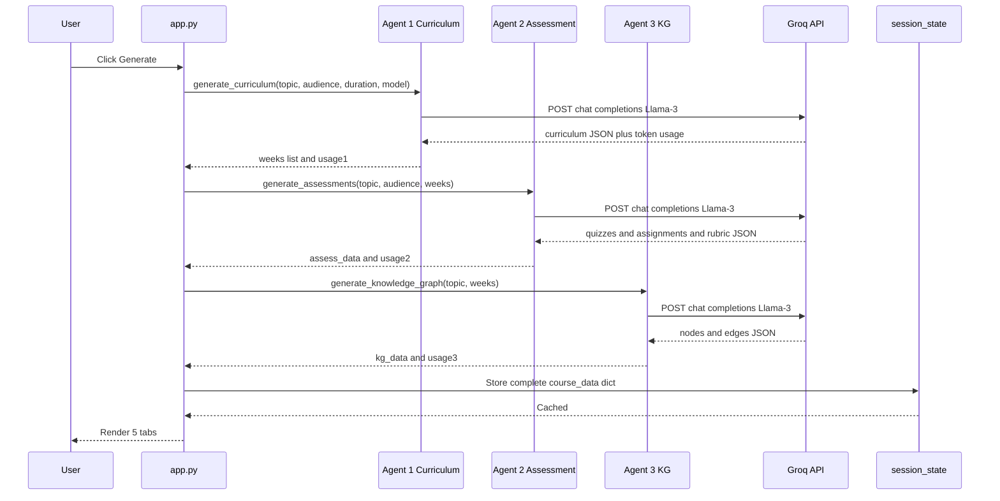

---

## 📐 Class Diagram

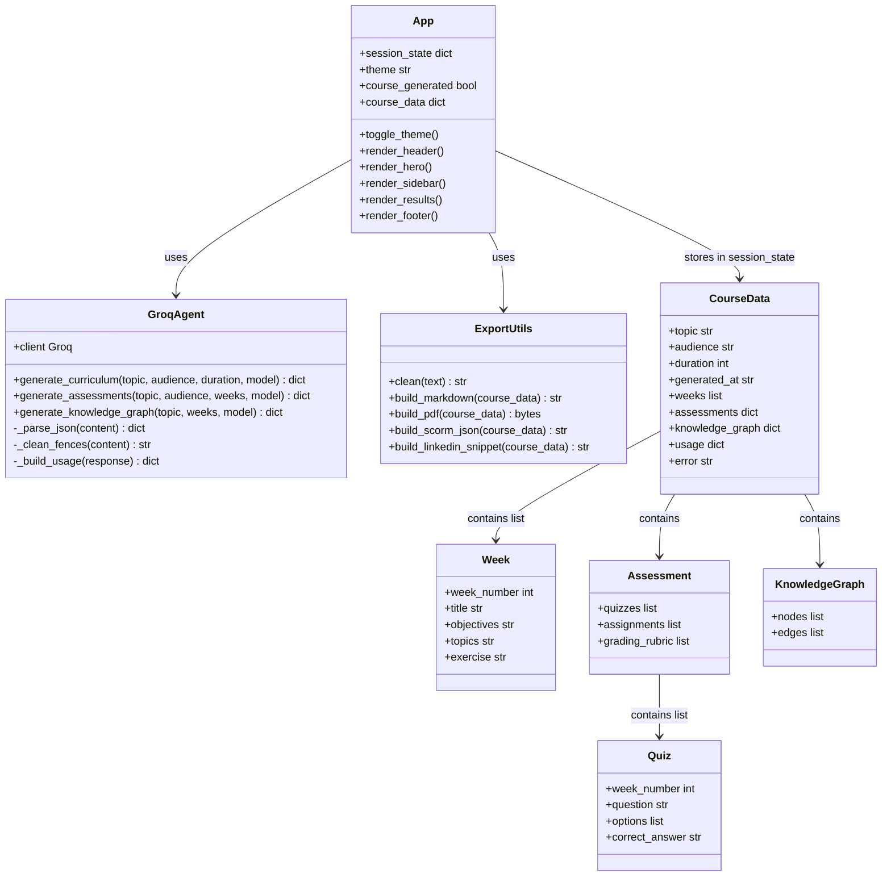

---

## 🗄️ Entity Relationship Diagram (ERD)

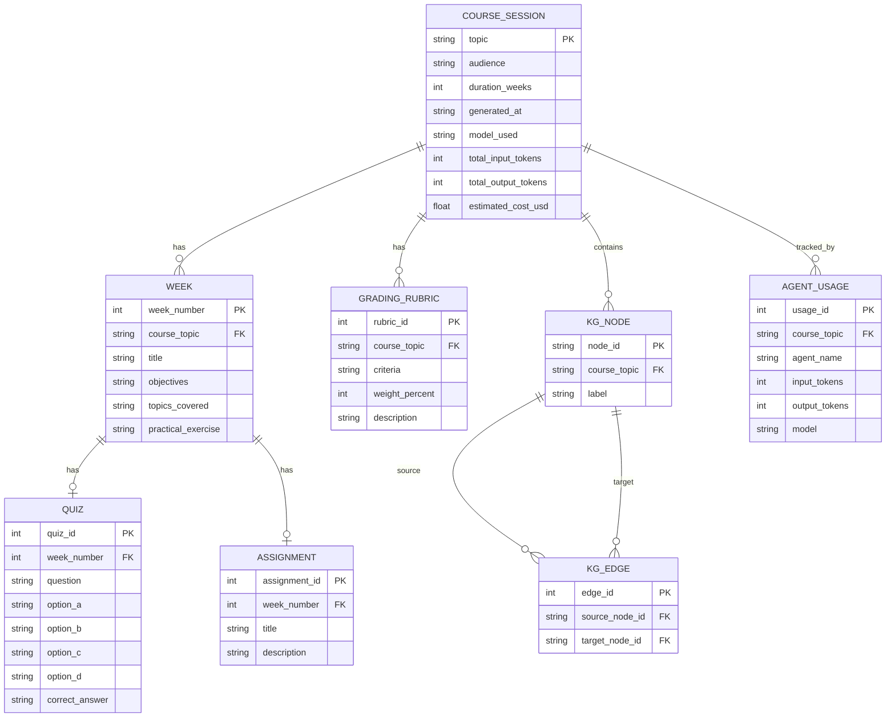

---

## 🛠️ Tech Stack

| Layer | Technology | Purpose |
|---|---|---|
| **Frontend** | Streamlit 1.58 | Web UI, tabs, sidebar, interactive widgets |
| **AI Inference** | Groq Cloud API | Ultra-fast LLM inference |
| **LLM Fast** | Llama-3.1-8b-instant | Fast draft generation |
| **LLM Quality** | Llama-3.3-70b-versatile | High-quality generation |
| **PDF Export** | fpdf2 2.8.7 | PDF generation with ASCII rendering |
| **Environment** | python-dotenv | Secure API key management |
| **HTTP Client** | httpx via groq SDK | API calls |
| **Data** | Python dicts + JSON | Inter-agent data passing |
| **Version Control** | Git + GitHub | Code versioning |
| **Deployment** | Streamlit Community Cloud | Production hosting |
| **Language** | Python 3.11+ | Core application language |

---

## 💼 Skills Demonstrated

### 🧠 Agentic AI and LLM Engineering
- Multi-Agent Orchestration — 3 specialized agents with distinct roles and structured JSON output schemas
- Prompt Engineering — System and user prompt design for reliable structured JSON output
- LLM Model Selection — Dynamic model switching (8B vs 70B) based on quality/speed tradeoff
- JSON Output Parsing — Robust parse and error recovery for LLM responses

### 🚀 Production Engineering
- Session State Management — `st.session_state` for persistent data across Streamlit reruns
- Secure Secret Management — `.env` locally, `st.secrets` in production with zero key leakage
- Error Handling — try/except at every agent call with graceful fallback UI messages
- Export Pipeline — Multi-format export (PDF/MD/JSON) with Unicode sanitization

### 🎨 Frontend and UI/UX
- Theming System — CSS variable-based dark/light mode with full contrast compliance
- Responsive Layout — Sidebar and main area works on desktop and mobile
- Custom HTML/CSS — Feature cards, week cards, quiz options, knowledge graph nodes

### ⚙️ DevOps and Deployment
- Git and GitHub — Repository management, clean commits, `.gitignore` best practices
- Cloud Deployment — Streamlit Community Cloud with secrets configuration
- Dependency Management — `requirements.txt` with pinned versions for reproducibility

---

## 📸 Screenshots

### Screenshot 1 — Application Home Screen


### Screenshot 2 — Course Settings Sidebar
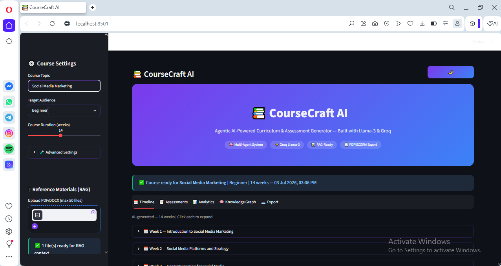

### Screenshot 3 — AI Generation in Progress
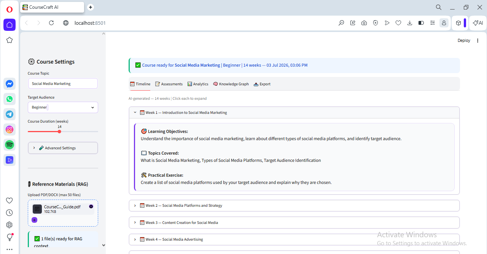

### Screenshot 4 — Timeline Tab with Weekly Curriculum
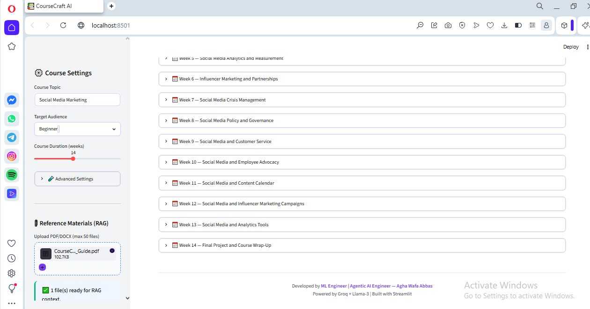

### Screenshot 5 — Assessments Tab with Quizzes and Rubric
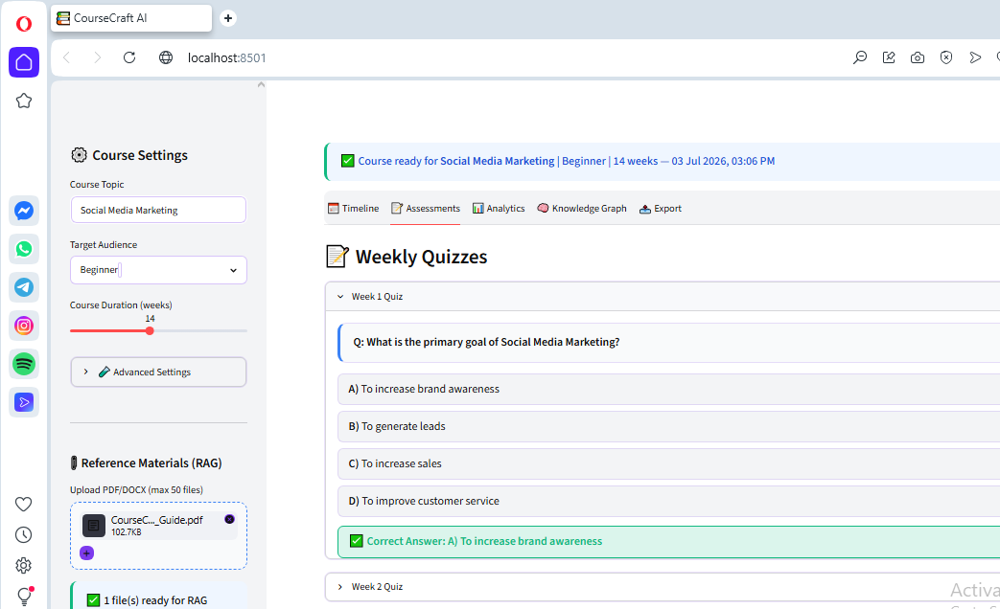

### Screenshot 6 — Assessments Tab with Assignments
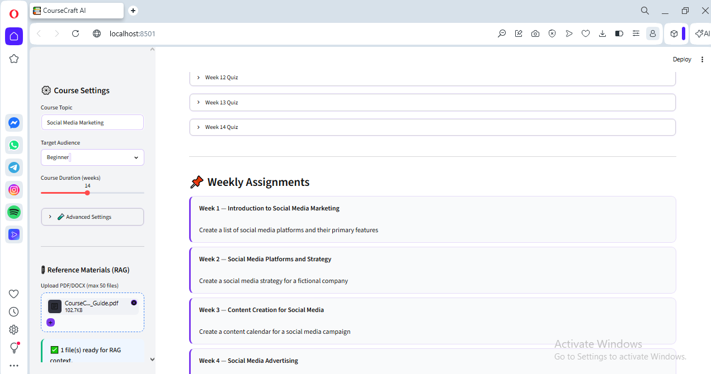

### Screenshot 7 — Assessments Tab with Assignments and Rubric
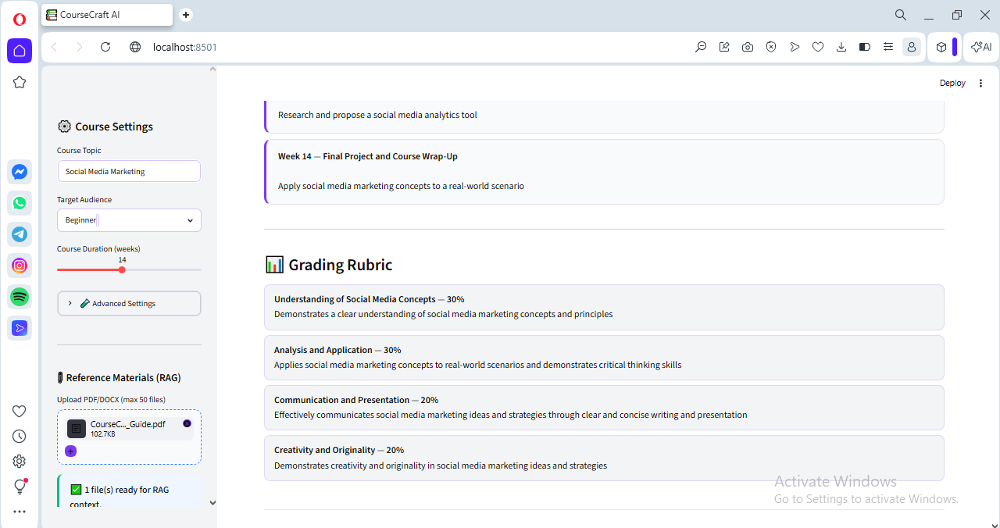

### Screenshot 8 — Analytics
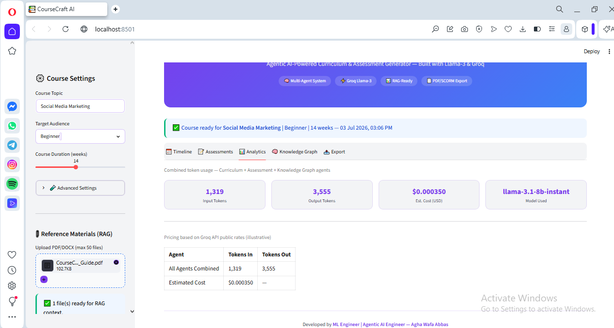

### Screenshot 9 — Light Mode View and Export Tab with Download Options
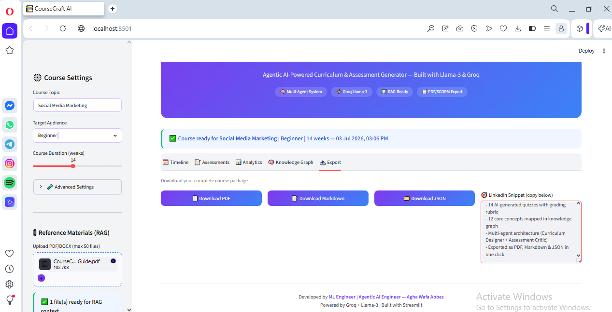

---

## 🚀 Local Setup

### Prerequisites
- Python 3.11+
- Groq API Key — [https://console.groq.com/keys](https://console.groq.com/keys)

### Step 1 — Clone Repository
```bash
git clone https://github.com/Aghawafaabbass/coursecraft-ai.git
cd coursecraft-ai
```

### Step 2 — Create Virtual Environment
```bash
python -m venv venv

# Windows
venv\Scripts\activate

# Mac/Linux
source venv/bin/activate
```

### Step 3 — Install Dependencies
```bash
pip install -r requirements.txt
```

### Step 4 — Configure API Key
Create a `.env` file in the root:
```env
GROQ_API_KEY=your_groq_api_key_here
```

### Step 5 — Run Application
```bash
streamlit run app.py
```

Open browser at `http://localhost:8501`

---

## ☁️ Deployment

### Streamlit Community Cloud
1. Push this repo to your GitHub
2. Go to [share.streamlit.io](https://share.streamlit.io)
3. Connect your GitHub repository
4. Set **Main file path:** `app.py`
5. Under **Advanced Settings → Secrets**, add:
```toml
GROQ_API_KEY = "your_groq_api_key_here"
```
6. Click **Deploy**

---

## 📁 Project Structure

```
coursecraft-ai/
│
├── app.py                  # Main Streamlit application
├── groq_agent.py           # All 3 AI agents
├── export_utils.py         # Export functions (PDF, Markdown, JSON, LinkedIn)
├── requirements.txt        # Python dependencies
├── .env                    # Local secrets (NOT committed to GitHub)
├── .gitignore              # Excludes venv, .env, __pycache__
├── test_agent.py           # Standalone agent test script
│
└── Screenshots/            # Application screenshots for README
    ├── Sc1.PNG
    ├── Sc2.PNG
    ├── Sc3.PNG
    ├── Sc4.PNG
    ├── Sc5.PNG
    ├── Sc6.PNG
    ├── Sc7.PNG
    ├── Sc8.PNG
    └── Sc9.PNG
```

---

## 🔮 Future Roadmap

| Feature | Priority | Description |
|---|---|---|
| **Full RAG Pipeline** | High | Extract text from uploaded PDFs/DOCX and inject as agent context |
| **Self-Correction Critic Loop** | High | Agent 2 reviews Agent 1 output and sends back for revision |
| **Interactive Knowledge Graph** | Medium | D3.js or PyVis force-directed graph visualization |
| **SCORM Export** | Medium | Full SCORM 1.2/2004 package for Moodle/Coursera import |
| **Slides Generator** | Medium | Auto-generate lecture slides from curriculum |
| **Multi-language Support** | Low | Generate curricula in Urdu, Arabic, French |
| **LMS API Integration** | Low | Push course directly to Moodle via REST API |

---

## ⚠️ Disclaimer

This project is developed for **educational, research, and portfolio demonstration purposes**. The AI-generated curriculum, assessments, and knowledge graphs are produced by large language models and should be reviewed and validated by qualified educators before use in any formal educational setting. The estimated API costs shown in the analytics dashboard are **illustrative approximations** based on publicly available Groq pricing and may not reflect actual billing.

---

## 👨‍💼 Author

<div align="center">

### **Agha Wafa Abbas**
*AI Solutions Architect · ML Scientist · Agentic AI Engineer · Lecturer · Researcher · Full-Stack Developer*

</div>

| Institution | Role | Contact |
|---|---|---|
| 🇬🇧 University of Portsmouth, UK | Lecturer | agha.wafa@port.ac.uk |
| 🇬🇧 Arden University, UK | Lecturer | awabbas@arden.ac.uk |
| 🇬🇧 Pearson, UK | Lecturer | — |
| 🇵🇰 IVY College, Lahore, Pakistan | Lecturer | wafa.abbas.lhr@rootsivy.edu.pk |

<div align="center">

[](https://github.com/Aghawafaabbass)
[](https://scholar.google.com/citations?user=79nqMaEAAAAJ)

📧 aghawafaabbass@gmail.com

</div>

---

## 📄 License

```
MIT License

Copyright (c) 2026 Agha Wafa Abbas

Permission is hereby granted, free of charge, to any person obtaining a copy
of this software and associated documentation files (the "Software"), to deal
in the Software without restriction, including without limitation the rights
to use, copy, modify, merge, publish, distribute, sublicense, and/or sell
copies of the Software, and to permit persons to whom the Software is
furnished to do so, subject to the following conditions:

The above copyright notice and this permission notice shall be included in all
copies or substantial portions of the Software.

THE SOFTWARE IS PROVIDED "AS IS", WITHOUT WARRANTY OF ANY KIND, EXPRESS OR
IMPLIED, INCLUDING BUT NOT LIMITED TO THE WARRANTIES OF MERCHANTABILITY,
FITNESS FOR A PARTICULAR PURPOSE AND NONINFRINGEMENT. IN NO EVENT SHALL THE
AUTHORS OR COPYRIGHT HOLDERS BE LIABLE FOR ANY CLAIM, DAMAGES OR OTHER
LIABILITY, WHETHER IN AN ACTION OF CONTRACT, TORT OR OTHERWISE, ARISING FROM,
OUT OF OR IN CONNECTION WITH THE SOFTWARE OR THE USE OR OTHER DEALINGS IN THE
SOFTWARE.
```

---

<div align="center">

**⭐ If this project helped you, please give it a star on GitHub!**

[](https://github.com/Aghawafaabbass/coursecraft-ai)

*Built with ❤️ by Agha Wafa Abbas · Powered by Groq + Llama-3 · Deployed on Streamlit Cloud*

</div>
