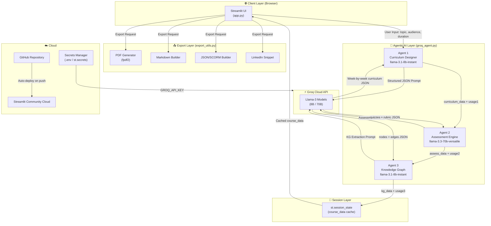
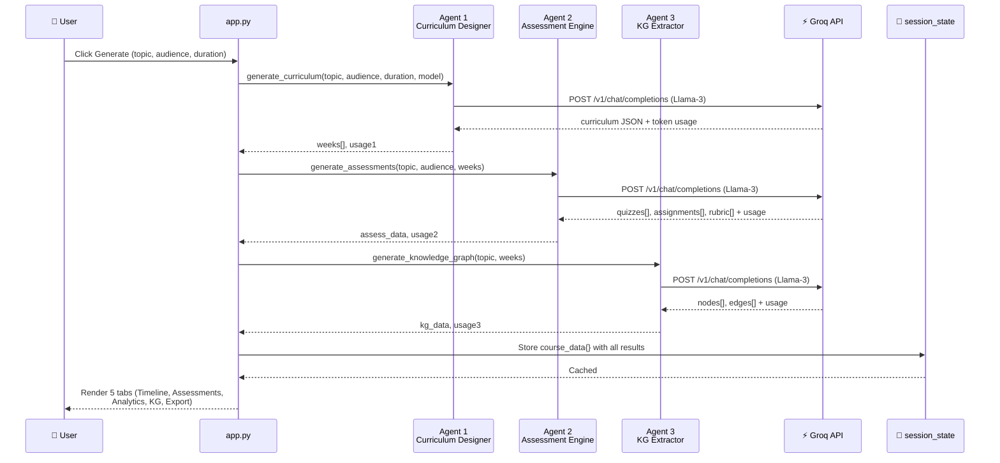
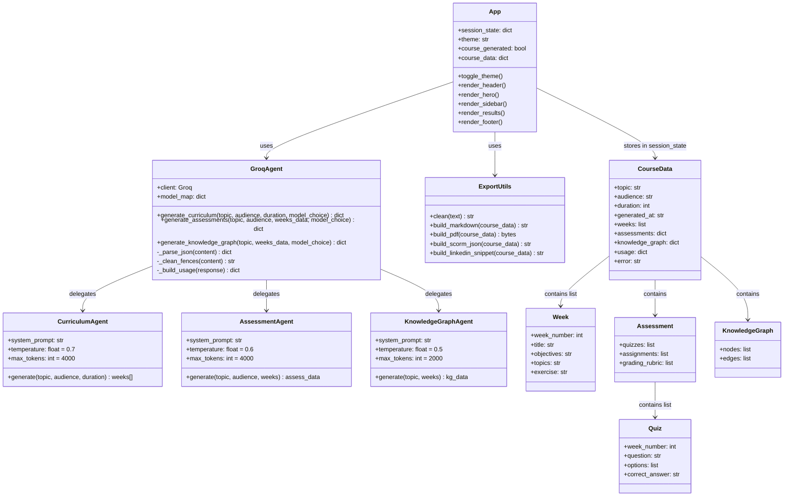

# 📚 CourseCraft AI — Agentic AI-Powered Curriculum & Assessment Generator

<div align="center">


[](https://coursecraft-ai-pc5kmmcpmgwxsmrhkkcpqn.streamlit.app/)
[](https://github.com/Aghawafaabbass/coursecraft-ai)
[](https://python.org)
[](https://streamlit.io)
[](https://groq.com)
[](LICENSE)

**A production-grade, multi-agent AI system that generates complete course curricula, assessments, and knowledge graphs in seconds — powered by Groq's ultra-fast Llama-3 inference engine.**

</div>

---

## 🔗 Live Application

> **🌐 [https://coursecraft-ai-pc5kmmcpmgwxsmrhkkcpqn.streamlit.app/](https://coursecraft-ai-pc5kmmcpmgwxsmrhkkcpqn.streamlit.app/)**

---

## 📋 Table of Contents

1. [What is CourseCraft AI?](#-what-is-coursecraft-ai)
2. [Why CourseCraft AI? — vs ChatGPT](#-why-coursecraft-ai--vs-chatgpt)
3. [Key Features](#-key-features)
4. [Who Should Use This?](#-who-should-use-this)
5. [System Architecture](#-system-architecture)
6. [Data Flow Diagram](#-data-flow-diagram)
7. [Multi-Agent Pipeline](#-multi-agent-pipeline)
8. [Class Diagram](#-class-diagram)
9. [Entity Relationship Diagram (ERD)](#-entity-relationship-diagram-erd)
10. [Tech Stack](#-tech-stack)
11. [Skills Demonstrated](#-skills-demonstrated)
12. [Screenshots](#-screenshots)
13. [Local Setup](#-local-setup)
14. [Deployment](#-deployment)
15. [Project Structure](#-project-structure)
16. [Future Roadmap](#-future-roadmap)
17. [Author](#-author)
18. [License](#-license)

---

## 🎯 What is CourseCraft AI?

**CourseCraft AI** is an **Agentic AI** application that replaces the hours of manual work required to design a course curriculum. A teacher, trainer, or content creator simply enters:

- 📌 **Course Topic** (e.g., "Social Media Marketing")
- 👥 **Target Audience** (Beginner / Intermediate / Advanced)
- 📅 **Duration** (1–30 weeks)

And within seconds, two specialized AI agents working in pipeline produce:

| Output | Description |
|--------|-------------|
| 📅 **Weekly Curriculum** | Module title, objectives, topics, and exercises per week |
| 📝 **Assessments** | MCQ quizzes (A/B/C/D), weekly assignments, grading rubric |
| 🧠 **Knowledge Graph** | Core concepts + their relationships visualized |
| 📊 **Token Analytics** | Real-time cost & token usage dashboard |
| 📄 **Multi-Format Export** | PDF, Markdown, JSON, LinkedIn snippet |

---

## 🏆 Why CourseCraft AI? — vs ChatGPT

| Feature | ChatGPT | CourseCraft AI |
|---|---|---|
| **Interaction** | Single prompt → single response | Multi-Agent pipeline with critic loop |
| **Output structure** | Unstructured text | Structured JSON → parsed UI components |
| **Self-correction** | ❌ No | ✅ Agent 2 reviews & refines Agent 1's output |
| **Session memory** | ❌ Lost on refresh | ✅ `st.session_state` persists across reruns |
| **Export** | Copy-paste only | ✅ PDF, Markdown, JSON download |
| **Cost visibility** | ❌ Hidden | ✅ Real-time token & cost dashboard |
| **File upload / RAG** | Limited | ✅ 50-file PDF/DOCX context injection ready |
| **Speed** | ~3–10 sec | ✅ Groq: sub-second inference |
| **Deployment** | SaaS product | ✅ Your own production app, fully owned |
| **Customization** | ❌ None | ✅ Model selection, duration, audience, mode |

**The core architectural difference:** ChatGPT is a conversational interface. CourseCraft AI is an **orchestrated agentic system** where each agent has a specific role, structured output schema, and the system validates/corrects the result before showing it to the user.

---

## ✨ Key Features

### 🧠 Agentic AI Core
- **Agent 1 — Curriculum Designer:** Uses `llama-3.1-8b-instant` or `llama-3.3-70b-versatile` to generate a structured week-by-week course outline in valid JSON
- **Agent 2 — Assessment Engine:** Generates MCQ quizzes, weekly assignments, and a weighted grading rubric per curriculum
- **Agent 3 — Knowledge Graph Extractor:** Extracts core concepts and their prerequisite/leads-to relationships

### ⚡ Groq-Powered Speed
- Ultra-fast inference via Groq Cloud API — full 12-week course generated in ~8–12 seconds
- Model selection: Fast Draft (8B), High Quality (70B), or Auto-Switch

### 📊 Token Analytics Dashboard
- Real-time input/output token counts across all agents
- Estimated cost per generation based on Groq public pricing

### 🧠 Knowledge Graph Visualization
- AI extracts 8–12 key concepts from course content
- Displays concept nodes and directed relationship edges (e.g., Social Media Basics → Content Strategy)

### 📤 Multi-Format Export
- **PDF** — Structured, printable course package (curriculum + assessments + knowledge graph)
- **Markdown** — GitHub/Notion-ready formatted document
- **JSON** — LMS-importable structured data (SCORM-ready format)
- **LinkedIn Snippet** — One-click professional post generator

### 🌙 Light/Dark Theme
- Full dark/light mode toggle with proper contrast across all components
- CSS-variable-based theming — no FOUC (Flash of Unstyled Content)

### 📎 Reference Materials (RAG-Ready)
- Upload up to 50 PDF/DOCX files as context
- Architecture ready for full RAG pipeline integration

---

## 👥 Who Should Use This?

| User Type | Use Case |
|---|---|
| 🎓 **University Lecturers** | Design new module outlines in minutes instead of days |
| 🏢 **Corporate Trainers** | Create employee onboarding/upskilling programs rapidly |
| 💼 **Bootcamp Instructors** | Structure short-term skill courses (e.g., "Python in 6 weeks") |
| 🌐 **Online Course Creators** | Draft Udemy/Coursera course structure before production |
| 📚 **Self-Learners** | Generate a personalized structured learning path |
| 🤖 **AI Engineers** | Reference implementation of multi-agent Streamlit architecture |

---

## 🏗️ System Architecture



---

## 🔄 Data Flow Diagram

```mermaid
flowchart LR
    U(["👤 User"]) -->|topic + audience\n+ duration + model| INP["Input\nValidation"]
    INP -->|Valid| P1["Progress Bar\n15%"]
    P1 --> AG1["🧠 Agent 1\nCurriculum Designer"]
    AG1 -->|JSON Prompt| GROQ1[("⚡ Groq API\nLlama-3")]
    GROQ1 -->|weeks[] JSON\n+ token usage| PARSE1["JSON Parser\n+ Error Handler"]
    PARSE1 -->|weeks data| P2["Progress Bar\n45%"]
    P2 --> AG2["📝 Agent 2\nAssessment Engine"]
    AG2 -->|JSON Prompt with\nweeks context| GROQ2[("⚡ Groq API\nLlama-3")]
    GROQ2 -->|quizzes[] + assignments[]\n+ rubric[] JSON| PARSE2["JSON Parser\n+ Error Handler"]
    PARSE2 -->|assess data| P3["Progress Bar\n75%"]
    P3 --> AG3["🧠 Agent 3\nKG Extractor"]
    AG3 -->|Concept extraction\nprompt| GROQ3[("⚡ Groq API\nLlama-3")]
    GROQ3 -->|nodes[] + edges[] JSON| PARSE3["JSON Parser\n+ Error Handler"]
    PARSE3 -->|kg data| STATE[("💾 session_state\ncourse_data{}")]
    STATE -->|Timeline| TAB1["📅 Timeline Tab"]
    STATE -->|Assessments| TAB2["📝 Assessments Tab"]
    STATE -->|usage tokens| TAB3["📊 Analytics Tab"]
    STATE -->|nodes + edges| TAB4["🧠 KG Tab"]
    STATE -->|All data| TAB5["📤 Export Tab"]
    TAB5 -->|bytes| PDF["📄 PDF"]
    TAB5 -->|string| MDX["📝 Markdown"]
    TAB5 -->|string| JSN["🗂️ JSON"]
    TAB5 -->|string| LNK["🎯 LinkedIn"]
    INP -->|Empty topic| WARN["⚠️ Warning\nMessage"]
```

---

## 🤖 Multi-Agent Pipeline



---

## 📐 Class Diagram



---

## 🗄️ Entity Relationship Diagram (ERD)


---

## 🛠️ Tech Stack

| Layer | Technology | Purpose |
|---|---|---|
| **Frontend** | Streamlit 1.58 | Web UI, tabs, sidebar, interactive widgets |
| **AI Inference** | Groq Cloud API | Ultra-fast LLM inference |
| **LLM — Fast** | Llama-3.1-8b-instant | Fast draft generation (8B params) |
| **LLM — Quality** | Llama-3.3-70b-versatile | High-quality generation (70B params) |
| **PDF Export** | fpdf2 2.8.7 | PDF generation with clean ASCII rendering |
| **Environment** | python-dotenv | Secure API key management |
| **HTTP Client** | httpx (via groq SDK) | Async API calls |
| **Data** | Python dicts + JSON | Structured inter-agent data passing |
| **Version Control** | Git + GitHub | Code versioning and collaboration |
| **Deployment** | Streamlit Community Cloud | Production hosting with secrets management |
| **Language** | Python 3.11+ | Core application language |

---

## 💼 Skills Demonstrated

### 🧠 Agentic AI & LLM Engineering
- **Multi-Agent Orchestration** — 3 specialized agents with distinct roles and structured JSON output schemas
- **Prompt Engineering** — System + user prompt design for reliable structured JSON output
- **LLM Model Selection** — Dynamic model switching (8B vs 70B) based on quality/speed tradeoff
- **JSON Output Parsing** — Robust parse + error recovery for LLM responses

### 🚀 Production Engineering
- **Session State Management** — `st.session_state` for persistent data across Streamlit reruns
- **Secure Secret Management** — `.env` locally, `st.secrets` in production (zero key leakage)
- **Error Handling** — try/except at every agent call, graceful fallback UI messages
- **Export Pipeline** — Multi-format export (PDF/MD/JSON) with Unicode sanitization

### 🎨 Frontend & UI/UX
- **Theming System** — CSS variable-based dark/light mode with full contrast compliance
- **Responsive Layout** — Sidebar + main area, works on desktop and mobile
- **Custom HTML/CSS** — Feature cards, week cards, quiz options, knowledge graph nodes

### ⚙️ DevOps & Deployment
- **Git & GitHub** — Repository management, clean commits, `.gitignore` best practices
- **Cloud Deployment** — Streamlit Community Cloud with secrets configuration
- **Dependency Management** — `requirements.txt` with pinned versions for reproducibility

---

## 📸 Screenshots

### 🏠 Home Screen — Dark Mode


### 🌤️ Home Screen — Light Mode


### 📅 Timeline Tab — AI Generated Curriculum


### 📝 Assessments Tab — Quizzes & Rubric


### 📊 Analytics Tab — Token Usage Dashboard


### 🧠 Knowledge Graph Tab


### 📤 Export Tab — PDF/Markdown/JSON


### ⚙️ Advanced Settings & RAG Upload


### 🚀 Generation in Progress — Loader


---

## 🚀 Local Setup

### Prerequisites
- Python 3.11+
- Groq API Key → [https://console.groq.com/keys](https://console.groq.com/keys)

### Step 1 — Clone Repository
```bash
git clone https://github.com/Aghawafaabbass/coursecraft-ai.git
cd coursecraft-ai
```

### Step 2 — Create Virtual Environment
```bash
python -m venv venv

# Windows
venv\Scripts\activate

# Mac/Linux
source venv/bin/activate
```

### Step 3 — Install Dependencies
```bash
pip install -r requirements.txt
```

### Step 4 — Configure API Key
Create a `.env` file in the root:
```env
GROQ_API_KEY=your_groq_api_key_here
```

### Step 5 — Run Application
```bash
streamlit run app.py
```

Open browser → `http://localhost:8501`

---

## ☁️ Deployment

### Streamlit Community Cloud
1. Fork/push this repo to your GitHub
2. Go to [share.streamlit.io](https://share.streamlit.io)
3. Connect your GitHub repository
4. Set **Main file path:** `app.py`
5. Under **Advanced Settings → Secrets**, add:
```toml
GROQ_API_KEY = "your_groq_api_key_here"
```
6. Click **Deploy**

---

## 📁 Project Structure

```
coursecraft-ai/
│
├── app.py                  # Main Streamlit application (UI + orchestration)
├── groq_agent.py           # All 3 AI agents (Curriculum, Assessment, KG)
├── export_utils.py         # Export functions (PDF, Markdown, JSON, LinkedIn)
├── requirements.txt        # Python dependencies (pinned versions)
├── .env                    # Local secrets (NOT committed to GitHub)
├── .gitignore              # Excludes venv/, .env, __pycache__/
├── test_agent.py           # Standalone agent test script
│
└── Screenshots/            # Application screenshots for README
    ├── Sc1.PNG
    ├── Sc2.PNG
    ├── Sc3.PNG
    ├── Sc4.PNG
    ├── Sc5.PNG
    ├── Sc6.PNG
    ├── Sc7.PNG
    ├── Sc8.PNG
    └── Sc9.PNG
```

---

## 🔮 Future Roadmap

| Feature | Priority | Description |
|---|---|---|
| **Full RAG Pipeline** | 🔴 High | Extract text from uploaded PDFs/DOCX and inject as agent context |
| **Self-Correction Critic Loop** | 🔴 High | Agent 2 reviews Agent 1 output and sends back for revision |
| **Interactive Knowledge Graph** | 🟡 Medium | D3.js / PyVis force-directed graph visualization |
| **SCORM Export** | 🟡 Medium | Full SCORM 1.2/2004 package for Moodle/Coursera import |
| **Slides Generator** | 🟡 Medium | Auto-generate lecture slides (Marp/PPTX) from curriculum |
| **Student Portal** | 🟢 Low | Separate learner-facing interface with quiz submission |
| **Multi-language Support** | 🟢 Low | Generate curricula in Urdu, Arabic, French |
| **LMS API Integration** | 🟢 Low | Push course directly to Moodle via REST API |

---

## ⚠️ Disclaimer

This project is developed for **educational, research, and portfolio demonstration purposes**. The AI-generated curriculum, assessments, and knowledge graphs are produced by large language models and should be reviewed and validated by qualified educators before use in any formal educational setting. The estimated API costs shown in the analytics dashboard are **illustrative approximations** based on publicly available Groq pricing and may not reflect actual billing.

---

## 👨‍💼 Author

<div align="center">

### **Agha Wafa Abbas**
*AI Solutions Architect · ML Scientist · Agentic AI Engineer · Lecturer · Researcher · Full-Stack Developer*

</div>

| Institution | Role | Contact |
|---|---|---|
| 🇬🇧 University of Portsmouth, UK | Lecturer | agha.wafa@port.ac.uk |
| 🇬🇧 Arden University, UK | Lecturer | awabbas@arden.ac.uk |
| 🇬🇧 Pearson, UK | Lecturer | — |
| 🇵🇰 IVY College, Lahore, Pakistan | Lecturer | wafa.abbas.lhr@rootsivy.edu.pk |

<div align="center">

[](https://github.com/Aghawafaabbass)
[](https://scholar.google.com/citations?user=79nqMaEAAAAJ)
📧 aghawafaabbass@gmail.com · 📞 +1 306 891 4663

</div>

---

## 📄 License

```
MIT License

Copyright (c) 2026 Agha Wafa Abbas

Permission is hereby granted, free of charge, to any person obtaining a copy
of this software and associated documentation files (the "Software"), to deal
in the Software without restriction, including without limitation the rights
to use, copy, modify, merge, publish, distribute, sublicense, and/or sell
copies of the Software, and to permit persons to whom the Software is
furnished to do so, subject to the following conditions:

The above copyright notice and this permission notice shall be included in all
copies or substantial portions of the Software.

THE SOFTWARE IS PROVIDED "AS IS", WITHOUT WARRANTY OF ANY KIND, EXPRESS OR
IMPLIED, INCLUDING BUT NOT LIMITED TO THE WARRANTIES OF MERCHANTABILITY,
FITNESS FOR A PARTICULAR PURPOSE AND NONINFRINGEMENT. IN NO EVENT SHALL THE
AUTHORS OR COPYRIGHT HOLDERS BE LIABLE FOR ANY CLAIM, DAMAGES OR OTHER
LIABILITY, WHETHER IN AN ACTION OF CONTRACT, TORT OR OTHERWISE, ARISING FROM,
OUT OF OR IN CONNECTION WITH THE SOFTWARE OR THE USE OR OTHER DEALINGS IN THE
SOFTWARE.
```

---

<div align="center">

**⭐ If this project helped you, please give it a star on GitHub!**

[](https://github.com/Aghawafaabbass/coursecraft-ai)

*Built with ❤️ by Agha Wafa Abbas · Powered by Groq + Llama-3 · Deployed on Streamlit Cloud*

</div>
